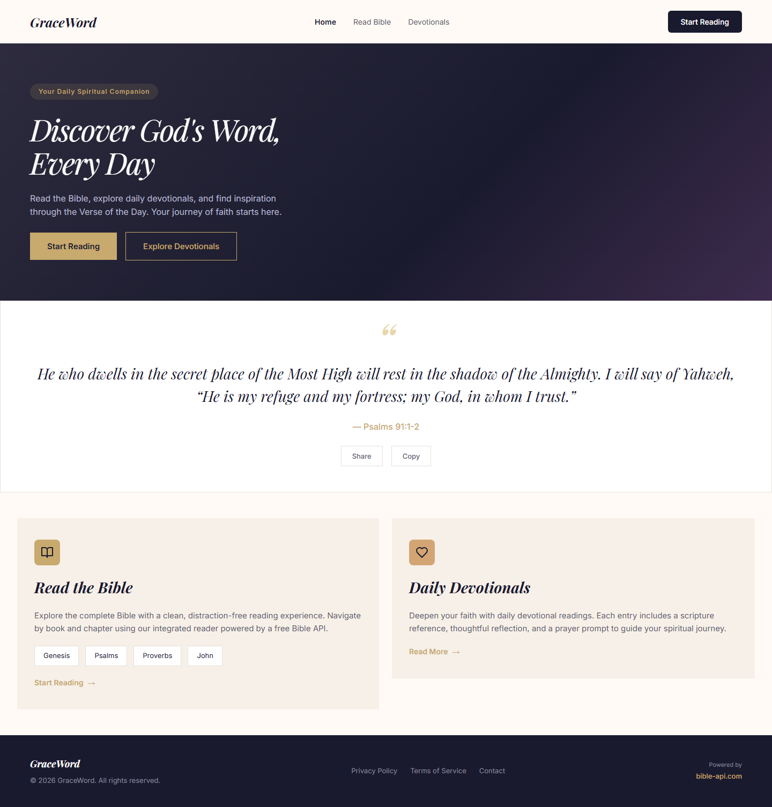
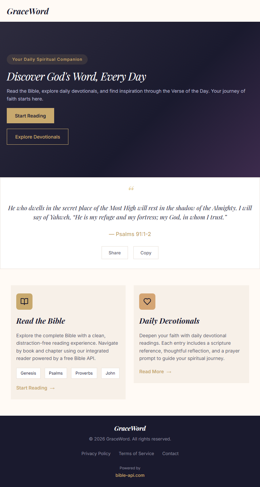
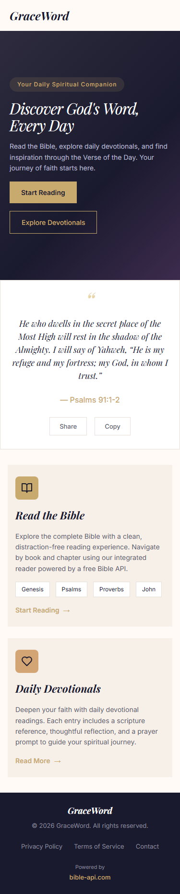
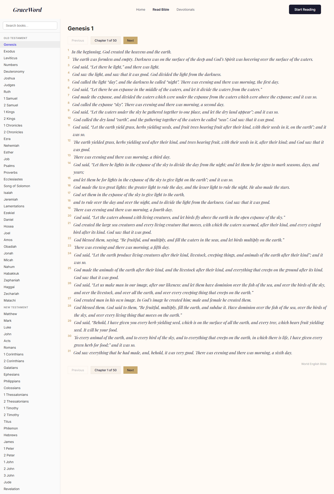
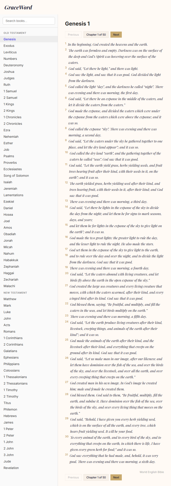
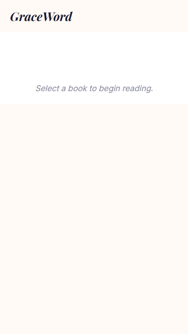
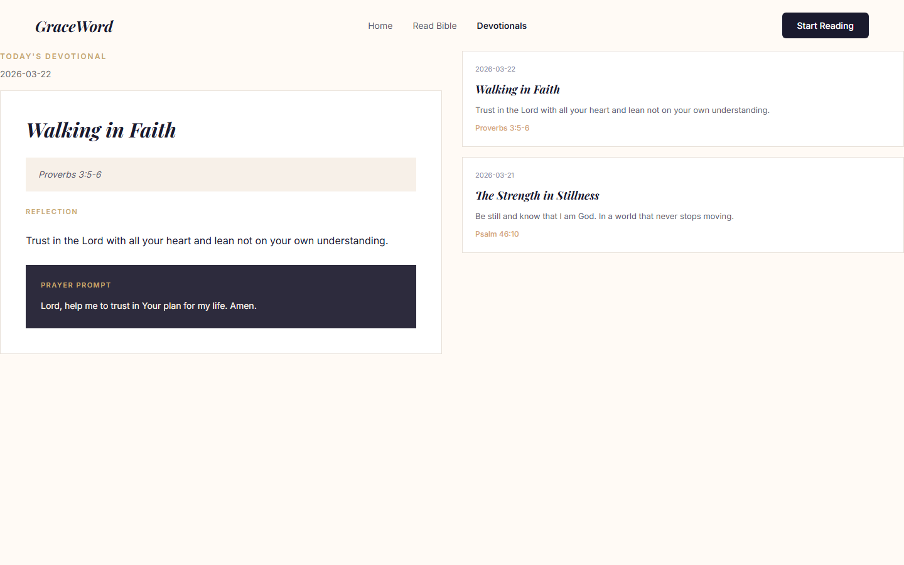
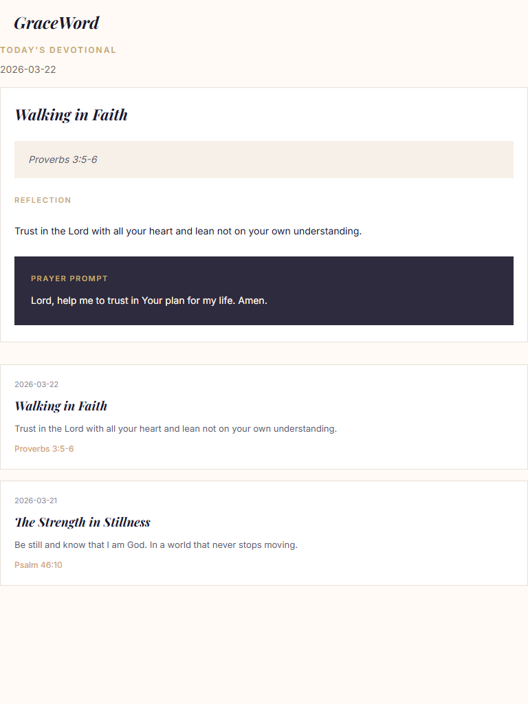
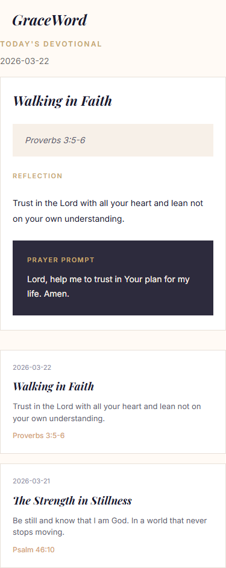

# Timilehin

A scripture-focused web application built with a .NET Web API backend and an Angular frontend. Read the Bible, explore daily devotionals, and find inspiration through the Verse of the Day.

## Overview

- A REST API in ASP.NET Core for Bible reading and devotionals
- SQLite-backed persistence for devotionals and daily verse caching
- An Angular workspace with three libraries (`api`, `components`, `domain`) and a browser app
- xUnit integration tests covering the API behavior
- Product requirements and a UI prototype under `docs/`

## Screenshots

### Homepage

| Desktop | Tablet | Mobile |
| --- | --- | --- |
|  |  |  |

### Bible Reader

| Desktop | Tablet | Mobile |
| --- | --- | --- |
|  |  |  |

### Devotionals

| Desktop | Tablet | Mobile |
| --- | --- | --- |
|  |  |  |

## Features

### API

- Retrieve a Bible chapter by book and chapter number
- Return a verse of the day from a curated rotation, cached once per day in SQLite
- Fall back gracefully if the external Bible API is unavailable
- Create, read, update, delete, and paginate devotionals
- Fetch today's devotional by date
- Expose an OpenAPI document in development

### Frontend

- **`api`** library — typed models and HTTP services for every backend endpoint
- **`components`** library — presentational UI building blocks (navbar, hero, verse card, devotional card, chapter nav, footer, etc.)
- **`domain`** library — smart container components that wire API services to presentational components with loading/error state management
- **`timilehin`** app — routes, global styles, and page shells that compose the domain containers

## Tech Stack

- ASP.NET Core targeting `.NET 11` preview
- Entity Framework Core with SQLite
- xUnit and `WebApplicationFactory` for API tests
- Angular 21 workspace with library packaging via `ng-packagr`
- External scripture data from `bible-api.com`

## Repository Layout

```text
.
|-- docs/
|   |-- specs/
|   |   |-- L1.md            # High-level requirements
|   |   `-- L2.md            # Detailed requirements & acceptance criteria
|   `-- ui-design.pen        # UI design prototype
|-- eng/
|   `-- scripts/
|       `-- run-all.bat       # Build libs, start backend + frontend
|-- src/
|   |-- Timilehin.Api/        # .NET Web API
|   `-- Timilehin.Web/        # Angular workspace
|       `-- projects/
|           |-- api/           # API client library
|           |-- components/    # Presentational components
|           |-- domain/        # Smart container components
|           `-- timilehin/     # Browser application
|-- tests/
|   `-- Timilehin.Api.Tests/
|-- CONTRIBUTING.md
|-- LICENSE
|-- README.md
`-- Timilehin.slnx
```

## Quick Start

### Prerequisites

- [.NET 11 SDK preview](https://dotnet.microsoft.com/download)
- Node.js and npm

### Run everything

The easiest way to start both the backend and frontend:

```bat
eng\scripts\run-all.bat
```

This builds the Angular libraries in dependency order, then launches the API on port 5256 and the Angular dev server on port 4200.

### Run the API only

```bash
dotnet restore Timilehin.slnx
dotnet run --project src/Timilehin.Api
```

- The SQLite database is created automatically on startup
- CORS origins come from `src/Timilehin.Api/appsettings.json`
- Default development URLs are `http://localhost:5256` and `https://localhost:7264`
- OpenAPI document available at `/openapi/v1.json` in development

### Run API tests

```bash
dotnet test Timilehin.slnx
```

### Build the Angular libraries manually

```bash
cd src/Timilehin.Web
npm install
npx ng build api
npx ng build components
npx ng build domain
```

### Run library tests

```bash
cd src/Timilehin.Web
npx ng test api --watch=false
npx ng test components --watch=false
npx ng test domain --watch=false
```

## API Surface

| Method | Route | Description |
| --- | --- | --- |
| `GET` | `/api/bible/{book}/{chapter}` | Get a Bible chapter |
| `GET` | `/api/verseoftheday` | Get the verse of the day |
| `GET` | `/api/devotionals?page=1&pageSize=10` | List devotionals with pagination |
| `GET` | `/api/devotionals/{id}` | Get a devotional by id |
| `GET` | `/api/devotionals/today` | Get today's devotional |
| `POST` | `/api/devotionals` | Create a devotional |
| `PUT` | `/api/devotionals/{id}` | Partially update a devotional |
| `DELETE` | `/api/devotionals/{id}` | Delete a devotional |

Example requests:

```bash
curl https://localhost:7264/api/verseoftheday
curl "https://localhost:7264/api/bible/Genesis/1"
```

## Configuration

Key settings live in `src/Timilehin.Api/appsettings.json`:

- `ConnectionStrings:DefaultConnection` — SQLite database path
- `Cors:Origins` — allowed frontend origins (defaults: `http://localhost:3000`, `http://localhost:5173`)

## Documentation

- [High-level requirements](docs/specs/L1.md)
- [Detailed requirements and acceptance criteria](docs/specs/L2.md)
- [UI design prototype](docs/ui-design.pen)
- [API scratch file for local requests](src/Timilehin.Api/Timilehin.Api.http)

## Contributing

See [CONTRIBUTING.md](CONTRIBUTING.md) for contribution guidelines.

## License

This project is licensed under the [MIT License](LICENSE).
